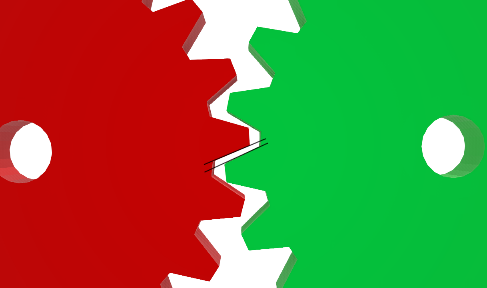

## Hinge Joint With Backlash

%figure



%end

Derived from [HingeJoint](../reference/hingejoint.md).

### HingeJointWithBacklash Model

```
HingeJointWithBacklash [
  SFNode       jointParameters   NULL   # {HingeJointParameters}
  SFFloat      backlash          0.1    # [0, inf)
  SFFloat      gearMass          0.01   # [0, inf)
  MFNode       device            [ ]    # {RotationalMotor, PositionSensor, Brake, PROTO}
  MFNode       outputSensor      [ ]    # {PositionSensor}
  MFNode       startPoint        NULL   # {Group, Transform, or Shape}
  SFNode       endPoint          NULL   # {Solid, SolidReference, or Slot}
]
```

The backlash effect is modeled by concatenating two consecutive [HingeJoint](../reference/hingejoint.md) where the first axis can freely turn while the second's range of
movement is limited by setting the values of `minStop` and `maxStop`. The difference between these values is imposed as the `backlash` itself and while the first joint is
within this range, no transfer of power occurs.

### Field Summary

- `backlash`: this field specifies the amount of clearance intrinsic to the transmission. The backlash is defined as the maximum distance that the driving
gear tooth can travel without any actual contact or transfer of power to the driven gear.

- `gearMass`: this field specifies the mass of the gear on the input side, that is, the object that is represented by the `startPoint` field. By default it's
assumed as being negligible but can be adjusted accordingly.

- `device`: this field optionally specifies a [RotationalMotor](rotationalmotor.md), an angular [PositionSensor](positionsensor.md) and/or a [Brake](brake.md) device.
If no motor is specified, the joint is passive joint.

- `outputSensor`: this field optionally specifies an angular [PositionSensor](positionsensor.md) fixed on the output axis of the joint.

> **Note**: what this sensor returns is the current position of the output axis in the range [-backlash/2, backlash/2]. When either limit is reached, the axis will begin to move

- `startPoint`: this field optionally specifies the shape of the object attached to the axis at the input of the joint. It must be either a [Transform](transform.md), a [Group](group.md) or a [Shape](shape.md). This object doesn't affect the joint in any way but can be useful in order to better visualize the effect of the backlash.

- `endPoint`: this field specifies which [Solid](solid.md) will be subjected to the joint constraints. It must be either a [Solid](solid.md) child, or a reference to an existing [Solid](solid.md), i.e. a [SolidReference](solidreference.md). Alternatively, a [Slot](slot.md) node can be inserted in the `endPoint` field, but this [Slot](slot.md) should be connected to another [Slot](slot.md) whose `endPoint` is either a [Solid](solid.md) or a [SolidReference](solidreference.md).

> **Note**: **Important**, due to the way the backlash is modeled, it is **necessary** for the `endPoint` solid to have physics **enabled** for the backlash effect to be active. If the physics node isn't activated, the simulation will work without giving any error but the resulting behavior will not model any backlash as it will be simulated in kinematic mode 
and the contact between the two hidden joints will be ignored.
